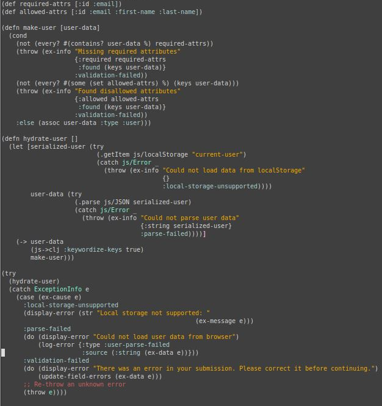
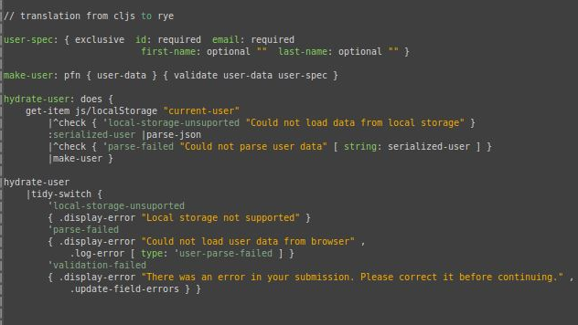
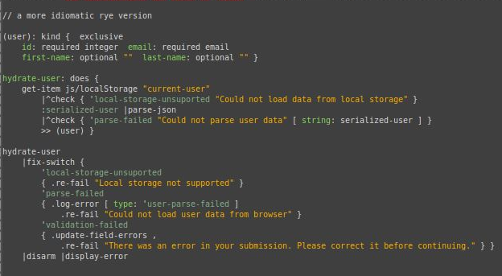

<b><a href="./TOUR_0.html">Meet Rye</a> &gt; Failures and errors</b>

# Failures and exceptions

_this concept is at a stage of a working thought experiment_
	
## Exceptions are where beautifull code goes to die

You can find many beautifull code snippets in various programming languages. But then it hits you. What if that file wasn't there, what if that
http call failed, etc. Most of the times, when you add exception handling the beauty is gone. But without them, the program is not really complete.
Certain failures are a part of reality.

So the idea is to try something _completely different_.

## Failures vs. code errors

Most languages combine all runtime mishaps into one group, exceptions. I think we have a two distinct event groups, that also require two distinct groups of reactions.

### Failures
		
Unpure functions have an effect / task to perform. It can be expected that sometimes some tasks can't be performed. Like I said: a file is not there, http request fails,
input data validation fails, etc ...

Failures are Rye values. We can work with them, handle them programatically and continue the execution of program.

### Code errors

Our program can arrive on a coding error at runtime. We never plan to make an error in our code and handle it. We remove the error.

Program is in an unpredictable state after an error, so it should "log" the error and stop. The way of logging the error is application specific and should be determined on application level.

### Unhandeled Failures

If the failure isn't handeled it becomes an Code error.

## Translation of failures

As code is a translation from a computer jargon, to problem, niche, and at the end user's jargon so should be the failures.

Lower level code shouldn't
define how failure is communicated to the user, but should return a failure or translate from a lower level failure to it's level of failure and return that to
it's callers.

## Catch and print

One of the most common antipattern for all this is so called "catch and print" on an individual exception level. It breaks all concepts above and is pointless. 

## Example of concepts

Most examples I could find of error handling in various languages, to compare my ideas on them, were sady very basic and uninteresting. This <a href="https://www.learn-clojurescript.com/section-4/lesson-24-handling-exceptions-and-errors/">clojurescript example</a>
was a little more invovled:

This was the aproximate translation to Rye:

This is a more idiomatic Rye, also using kinds:
	

	
</body>
</html>
